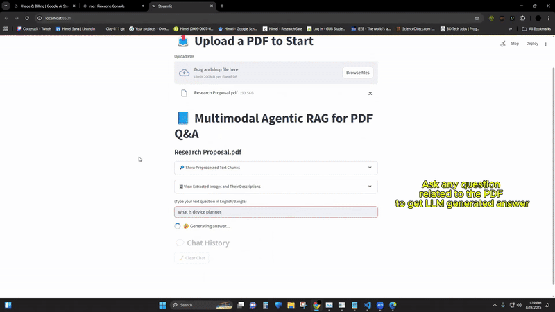

# 📖 Multimodal RAG Pipeline for PDF(s)
s
---

# ⏩ Video Explanation

⏩ Demo Video Link: https://youtu.be/BMsZLLyWoKg

⏩ Download the video here: [Explanation Video.mp4](English_Bangla_PDF_Example.mp4).

---



---

## 🚀 Project Overview

A **multimodal Retrieval-Augmented Generation (RAG)** system built with **Streamlit**, **LangChain**, **Pinecone**, and **Google Gemini (Text + Vision models)**.  
This project allows you to upload Bangla/English PDFs, extract **text + images**, run **OCR** on both, and enrich images with **vision-language models (VLMs)** to generate descriptions.  
All extracted information is chunked, embedded, stored in **Pinecone**, and retrieved to power **LLM-based Q&A**.


- Extracts **text & images** from PDFs (via `PyMuPDF` + `pdf2image` + `pytesseractOCR`).
- Generates **descriptions for images** using **Gemini Vision model**.
- Splits extracted content into chunks with **LangChain** text splitter (RecursiveCharacterTextSplitter).
- Embeds chunks with **HuggingFace embeddings** (intfloat/multilingual-e5-large).
- Stores and retrieves context using **Pinecone Vector DB**.
- Runs **retrieval-augmented QA** via **Gemini LLM**.
- Provides a **Streamlit UI** for easy interaction.

---


## 🧠 What Each File Does

- **app.py** → Runs the Streamlit app, connects everything.
- **config.py** → Stores API keys, model configs, Pinecone setup (centralized).
- **processing/ocr.py** → OCR on PDF pages.
- **processing/images.py** → Extracts and saves PDF images.
- **processing/chunking.py** → Splits extracted text into retrievable chunks.
- **processing/pipeline.py** → Master pipeline: PDF → OCR/Text/Images → Pinecone.
- **retriever/embeddings.py** → Handles HuggingFace embeddings.
- **retriever/pinecone_utils.py** → Initializes Pinecone index + connection.
- **retriever/pinecone_retriever.py** → Retriever wrapper for QA chain.
- **qa/chain.py** → Builds the RetrievalQA chain.
- **qa/multi_image_query.py** → Handles multimodal queries (text + images).
- **ui/streamlit_ui.py** → Defines Streamlit layout & user interface.

---

## 🔄 Workflow

1. Upload a PDF (Bangla/English supported).
2. **Text Extraction**: OCR extracts text.  
3. **Image Extraction**: Extract images + caption them with Gemini Vision.  
4. **Chunking**: Split extracted data into retrievable chunks.  
5. **Embedding & Storage**: Store embeddings in Pinecone.  
6. **Retrieval & QA**: User asks questions → retriever pulls context → Gemini LLM answers.

---

## ⚙️ How to Run

1. Install dependencies:
   ```bash
   pip install -r requirements.txt
2. Download Tesseract-OCR and install it exactly in this folder: `C:\\Program Files\\Tesseract-OCR\\tesseract.exe`
3. Download Poppler for Windows: https://github.com/oschwartz10612/poppler-windows/releases/
   - Extract the zip exactly here: `C:\poppler`
   - Add Poppler to PATH:
     - Open **Start Menu → Environment Variables**
     - Under **System Variables**, find Path and click Edit
     - Add this path: `C:\poppler\Library\bin`
4. Sign in to **Pinecone** and create api and index as needed.
5. Generate **Gemini api**.
4. Edit **config.py** with your own keys:
   ```bash
   GOOGLE_API_KEY = "your_google_api_key"
   PINECONE_API_KEY = "your_pinecone_api_key"
   PINECONE_ENV = "your_pinecone_environment"
   PINECONE_INDEX = "your_index_name"

   TEXT_MODEL = "gemini-pro"
   VISION_MODEL = "gemini-pro-vision"

5. Run the app
   ```bash
   streamlit run app.py
6. In the UI:
   - You will see: **📘 Multimodal Agentic RAG for PDF Q&A**
   - Use the file uploader to upload PDF(s).
   - Wait for the processing to complete.
   - After that: Click **🔎 Show Preprocessed Text Chunks** to see the text chunks.
   - Click **🖼 View Extracted Images and Their Descriptions** to see extracted images with their VLM generated descriptions.
   - You can **Type your text question in English/Bangla** to see LLM generated precise answers.
   - After an answer is generated you can click **📌 Show Source Chunks & Images for Q&A** to see relevant text chunks and images the LLM used to generate the answer.
   - Lastly, click **🧹 Clear Chat** to remove the chat history for that session.
  


